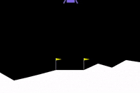

# Reinforcement Learning
Implementation of selected Reinforcement Learning Algorithms using Pytorch on environments from OpenAI gym.

Ready:
* REINFORCE
* Simple Actor-Critic with shared weights
* Actor-Critic without shared weights & GAE
* PPO without shared weights & GAE & early stopping with KL
* PPO without shared weights & GAE & mini batches
* PPO with continues action space on Lunar Lander environment
* DDPG on the Pendulum environment

Working on:
* RNN with RL
* Parallelization
* RL with a sparse reward function
* Simple Multi-Agent

